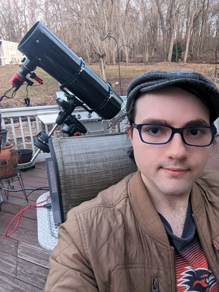

<html>
	<head>
		<title>Seth Pritchard</title>
		<meta charset="utf-8" />
		<meta name="viewport" content="width=device-width, initial-scale=1, user-scalable=no" />
		<!-- 	This links to this page's CSS, which is contained in the folder assets/css and the file main.css.
			 If you want to edit the styling of this page, you should edit the file assets/css/main.css
			 If you have a new CSS file you'd like to add with custom styling, you should link to it here using:
			 <link rel="stylesheet" href="assets/css/my-new-css-file.css"/> 
		-->
		<link rel="stylesheet" href="assets/css/main.css" />
		<!-- 	In the case that the user's browser does not support JavaScript (unlikely, but possible), the page
			will load a separate set of CSS stylings from the file assets/css/noscript.css
			Any HTML contained inside <noscript></noscript> tags will be loaded in the event that JavaScript is not
			available. 
		-->
		<noscript><link rel="stylesheet" href="assets/css/noscript.css" /></noscript>
	</head>
	<!-- The body is the location where your site's content will go -->
	<body class="is-preload">

			<!-- This "div" wraps around all of our content and just changes how things are layed out -->
			

					<!-- This is where the content that appears on page load exists -->
					<header id="header">
						<!-- This is the main content of the front page -->
						

							

								<!-- Here is a heading where you can put your name -->
								<h1>
									Seth Pritchard
								</h1>
								<!-- 	Here is an image where you can put a picture of you. 
									You can change the width and height attributes below to change how large
									your image is.

									Try adding "border-radius: 50%;" to the style attribute.
								-->
								
								<!-- 	Here is a paragraph where you can put your position and institution, or
									a short line about yourself.
								-->
								
Recent graduate with a bachelor’s degree in physics seeking graduate programs and career opportunities in astronomy, with experience in calibration and metrology, 
									materials science research, and data reduction. Research interests include photometry, planetary formation and evolution, exoplanet detection and characterization, 
									astrobiology, and human spaceflight.

								<!-- Here is a paragraph where you can put a link to your CV -->
								

									<!-- Note you will want to change where this points to! -->
									<a href="assets/CV.pdf" target="_blank">Curriculum Vitae</a>
								

							

						

						<!-- This is the navigation menu -->
						<nav>
							<!-- This element makes an "Unordered List" -->
							<ul>
								<!-- This is a "List Item" -->
								<li>
									<!-- 	Note that this links to #about, which will move the page to wherever
										the element with the id "about" exists.
									-->
									<a href="#about">About Me</a>
								</li>
								<li>
									<a href="#research">Research</a>
								</li>
								<li>
									<a href="#community">Community</a>
								</li>
								<li>
									<a href="#contact">Contact</a>
								</li>
								<!-- 	You can add another button to your navigation menu by adding
									another List Item with a link inside of it.
								-->
								<!-- <li>
									<a href="images/Astronomy.jpg">My CV</a>
								</li> -->
							</ul>
						</nav>
					</header>
